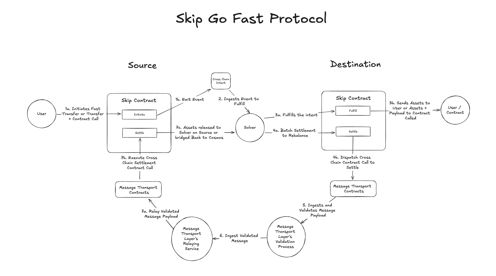

# Skip Go Fast Contracts

The contracts in this repository are used in Skip Go Fast, a decentralized bridging protocol that enables faster-than-finality cross-chain actions across all major ecosystems, starting with Cosmos and Ethereum.

# Skip Go Fast Design Overview

The Go Fast Protocol is designed to enable rapid cross-chain asset transfers and smart contract execution between a source chain and a destination chain. The system facilitates these transfers through a combination of user-initiated intents, solver fulfillment, and settlement processes that are maximally compatible with ERC-7683.

## User Fulfillment Process

1. **Intent Initiation**: A user on the source chain wants to either transfer assets or transfer assets along with a message payload to a destination chain within seconds. They initiate this process by calling the Skip Go Fast Protocol contract deployed on the source chain. The user provides the necessary assets, message payload, and any associated fees, specifying the desired address on the destination chain. This action triggers an event that solvers monitor, and a unique ID is generated to map directly to the user’s intent.
2. **Solver Detection**: Solvers, running specialized software, monitor for intent events emitted by the Skip Go Fast contract on the source chain. A solver assesses whether fulfilling the intent aligns with their risk/reward profile and if they have the required resources on the destination chain to fulfill the intent.
3. **Fulfillment**: The solver proceeds by calling the Skip Go Fast Protocol contract deployed on the destination chain, executing the transfer of assets and processing the message payload as specified. The contract on the destination chain then executes the intended action, whether it be transferring assets to a specified address or executing a contract call with the provided assets and payload. The solver’s address is recorded, and a unique ID is generated to link the solver’s fulfillment to the intent solved.
4. **Completion**: From the user’s perspective, the intended transfer and message execution (if applicable) are complete, and they have successfully achieved their goal on the destination chain.

## Solver Settlement Process

1. **Settlement Initiation**: After fulfilling one or more intents, the solver on the destination chain seeks to recover any assets they fronted, along with the fees earned. The solver initiates the settlement process by calling the Skip Go contract deployed on the destination chain, specifying the intent IDs they fulfilled and the address on the source chain where they wish to receive their compensation.
2. **Cross-Chain Verification**: The Skip Go contract on the destination chain verifies the solver’s fulfillment of the specified IDs and dispatches a cross-chain message via a message-passing protocol. The message-passing protocol’s verification service ingests the payload and attests to its validity for processing on the source chain.
3. **Relay and Settlement**: A relayer from the message-passing protocol takes the attested payload and relays it to the contracts deployed on the source chain. The Skip Go contract on the source chain is then called, which verifies that the specified intents were accurately fulfilled based on the signing set’s attestation. Upon successful verification, the assets and fees are released to the solver’s specified address on the source chain.
4. **Completion**: The solver has now received the assets they fronted for the user, along with the service fee they earned, completing the settlement process.